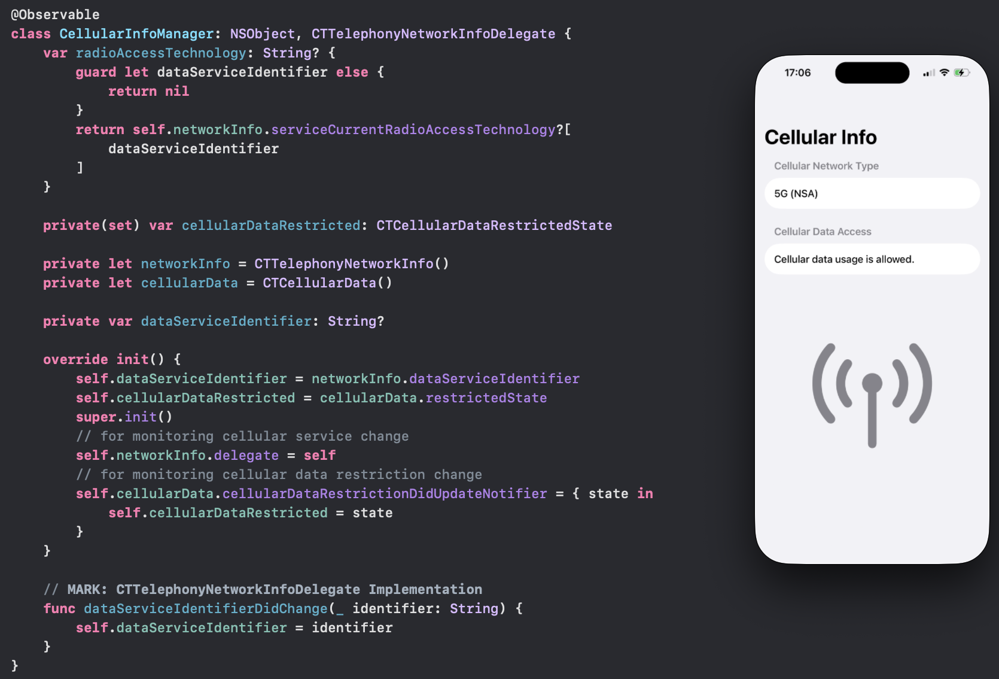

# SwiftUI_CellularInfoDemo
A demo of getting and monitoring cellular service information such as network type and restricted state.

For more details, please check out my article [Little SwiftUI Tip: Getting Some Cellular Information + Monitoring Changes](https://medium.com/@itsuki.enjoy/little-swiftui-tip-getting-some-cellular-information-monitoring-changes-820e717f8c3f)

